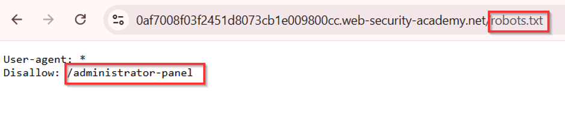

# Lab: Unprotected Admin Functionality

## Objective

Access an administrative function that is not protected by proper authorization and delete the user `carlos`.

## Vulnerability

The application exposes a sensitive administrative endpoint without enforcing server-side access control. The path is also disclosed through `robots.txt`.

## Exploitation Steps

1. Open the lab and request `/robots.txt`.
2. Observe the `Disallow` directive revealing the administrator path.

3. Replace `/robots.txt` in the URL with the disclosed administrator path.
4. Open the admin panel.
5. Delete the user `carlos`.

## Why It Works

The application relies on the admin URL being hidden instead of checking whether the current user is actually authorized to access the endpoint.

## Security Impact

An unauthenticated or low-privileged user may be able to access administrative actions directly, potentially leading to account deletion, privilege changes, or other sensitive operations.

## Remediation

Enforce authorization checks on every administrative endpoint on the server side. Do not treat hidden links or `robots.txt` exclusions as security controls.

## Key Takeaway

Always check `robots.txt` during reconnaissance, but remember that any disclosed path must still be protected by real authorization checks.
