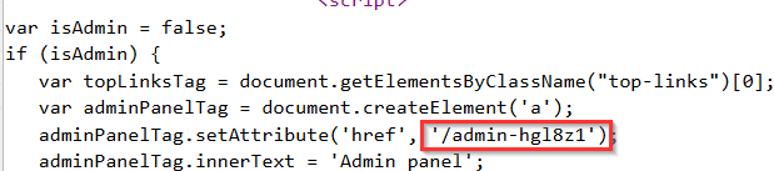

# Lab: Unprotected Functionality — Security by Obscurity

## Objective

Discover a hidden administrative endpoint and use it to delete the user `carlos`.

## Vulnerability

The application attempts to protect the admin panel by using an unpredictable URL. However, the URL is exposed in client-side JavaScript and the endpoint itself is not properly access-controlled.

## Exploitation Steps

1. Open the lab home page.
2. Inspect the page source using Burp Suite or browser developer tools.
3. Locate the JavaScript that creates the admin panel link.
4. Observe that the hidden administrator path is visible in the script.

5. Browse directly to the disclosed admin path.
6. Delete the user `carlos`.

## Why It Works

Client-side code is visible to the user. Hiding a URL behind role-based interface logic does not stop a user from discovering or requesting the endpoint directly.

## Security Impact

Attackers may discover supposedly hidden privileged functionality and perform unauthorized administrative actions.

## Remediation

Protect sensitive endpoints with server-side authorization checks. Do not rely on secret, random, or hard-to-guess URLs as the primary security control.

## Key Takeaway

Anything sent to the browser should be considered discoverable. Security by obscurity is not a substitute for authorization.
