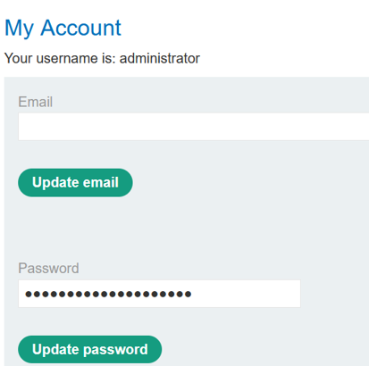
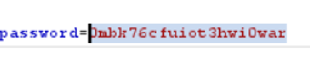

# Lab: User ID Controlled by Request Parameter with Password Disclosure

## Objective

Access the administrator's account data, recover the administrator password, log in as the administrator, and delete `carlos`.

## Vulnerability

The application allows users to access another account by changing a user-controlled `id` parameter. The account page also exposes the user's password in the response, allowing horizontal privilege escalation to become vertical privilege escalation.

## Exploitation Steps

1. Log in with the supplied credentials and open the account page.
2. Observe that the request references the current user, for example:

```text
/my-account?id=wiener
```


3. Change the `id` parameter to `administrator`.


4. Load the administrator's account page and observe that a password field is present.



5. Inspect the response in Burp Suite and recover the password value.



6. Log out of the current account.
7. Log in as `administrator` using the disclosed password.
8. Open the admin panel and delete `carlos`.

## Why It Works

The application fails to enforce object-level authorization on account pages and also exposes sensitive credential material in the response. These two weaknesses can be chained together.

## Security Impact

A normal user can compromise a privileged account, resulting in full vertical privilege escalation and access to administrative functionality.

## Remediation

Enforce ownership checks on every account request and never return plaintext or recoverable passwords to the client. Passwords should be securely hashed and should never be retrievable from an account page.

## Key Takeaway

Horizontal access control flaws become significantly more dangerous when the exposed object contains credentials or privileged account data.
