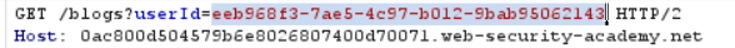

# Lab: User ID Controlled by Request Parameter, with Unpredictable User IDs

## Objective

Use another user's leaked identifier to access their account data and retrieve the required API key.

## Vulnerability

The application uses unpredictable user IDs, but it does not properly verify that the authenticated user is authorized to access the requested account object.

## Exploitation Steps

1. Find a blog post written by `carlos`.
2. Open the author's profile or inspect the related request.
3. Observe that the request contains Carlos's user ID.

4. Record the disclosed user ID.
5. Log in using the supplied credentials and open your account page.
6. Replace your own `id` parameter with Carlos's user ID.
7. Load the account page belonging to Carlos.
8. Retrieve and submit the API key.

## Why It Works

The application treats possession of a valid object identifier as sufficient authorization. The ID may be difficult to guess, but it can still be discovered elsewhere in the application.

## Security Impact

An authenticated user may access sensitive information belonging to another user, including API keys, personal details, or account data.

## Remediation

For every object request, verify on the server that the authenticated user is authorized to access that specific object. Unpredictable IDs can reduce guessability but must not replace access control.

## Key Takeaway

A GUID or random identifier is not an authorization mechanism. If the application leaks the identifier anywhere, broken object-level authorization can still be exploited.
