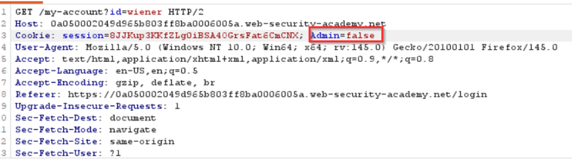
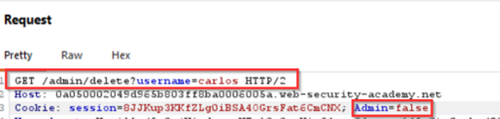
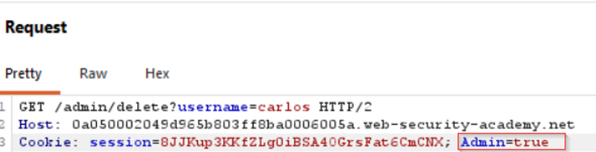

# Lab: User Role Controlled by Request Parameter

## Objective

Escalate privileges by modifying a user-controlled role value and delete the user `carlos`.

## Vulnerability

The application stores the user's authorization state in a client-controlled cookie named `Admin`. The server trusts this value when deciding whether administrative actions are allowed.

## Exploitation Steps

1. Browse to `/admin` and confirm that the admin panel is inaccessible.
2. Log in with the supplied credentials while intercepting traffic in Burp Suite.
3. Inspect the request and observe the cookie value:

```text
Admin=false
```



4. Observe that an administrative request is sent with `Admin=false`.



5. Change the cookie to:

```text
Admin=true
```

6. Forward the modified request.



7. Access the admin functionality and delete `carlos`.

## Why It Works

The server bases authorization on a value supplied by the client. Because the user can modify the cookie, the user can also modify the server's authorization decision.

## Security Impact

A normal user may be able to grant themselves administrative privileges and perform high-impact actions.

## Remediation

Store role and privilege information in trusted server-side session state. Never rely on an unsigned or otherwise user-controlled cookie, hidden field, or query parameter for authorization decisions.

```python
current_user = get_authenticated_user()

if current_user.role != "admin":
    return "Forbidden", 403
```
Here, current_user.role should come from a trusted server-side source such as the database or a securely validated server-side session, not from a value the user can edit in the browser.

## Key Takeaway

Authentication data and authorization data are not the same thing. Even an authenticated session is insecure if the server trusts client-controlled role values.
