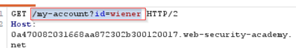
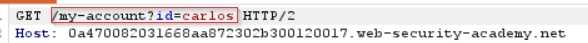

# Lab: 2FA Simple Bypass

## Objective

Access the victim's account even though their two-factor authentication code is unavailable.

## Vulnerability

The application verifies the username and password first and then displays a separate 2FA verification page. However, the server does not actually enforce completion of the second factor before allowing access to the account page.

As a result, a user with valid primary credentials can directly request the protected account page and bypass 2FA entirely.

## Analysis

I first logged in to my own account and completed the normal 2FA process. This allowed me to identify the URL of the protected account page:

```text
/my-account?id=wiener
```



I then logged out and authenticated using the victim's valid username and password. When the application requested the 2FA verification code, I did not complete that step.

Instead, I manually navigated directly to the protected account page for the victim.

```text
/my-account?id=carlos
```



The page loaded even though the second factor had never been verified.


## Why It Works

The application treats successful password authentication as sufficient to establish access to protected resources.

The 2FA page exists, but the server does not maintain and enforce a state such as:

```text
password_verified = true
mfa_verified = false
```

A protected account request should only succeed when both conditions are satisfied.

Instead, the vulnerable application effectively performs:

```text
Correct password
      ↓
Session accepted for protected resources
      ↓
2FA page shown only as an additional UI step
```

This means the second factor is not actually part of the authorization decision.

## Security Impact

If an attacker obtains a user's username and password through phishing, credential stuffing, malware or another breach, they can bypass the intended second layer of protection. This defeats the main purpose of MFA and can result in full account takeover.

## Remediation

The server must record whether the second factor has been successfully completed and enforce that state on **every protected request**.

### Illustrative Remediation Example

After successful password verification:

```python
session["user_id"] = user.id
session["password_verified"] = True
session["mfa_verified"] = False

return redirect("/verify-2fa")
```

After the user submits the correct 2FA code:

```python
if verify_2fa_code(session["user_id"], submitted_code):
    session["mfa_verified"] = True
    return redirect("/my-account")

return "Invalid verification code", 401
```

Every protected endpoint should then enforce the MFA state:

```python
@app.route("/my-account")
def my_account():
    if not session.get("user_id"):
        return "Unauthorized", 401

    if not session.get("mfa_verified"):
        return redirect("/verify-2fa")

    user = get_user(session["user_id"])
    return render_template("account.html", user=user)
```

The important point is that the browser should not decide whether MFA is complete. The server must track and validate that state.

## Key Takeaway

Displaying a 2FA page is not enough. The server must ensure that the second factor has been successfully completed before granting access to any protected resource. MFA is only effective when it is enforced as part of the server-side authentication state.
