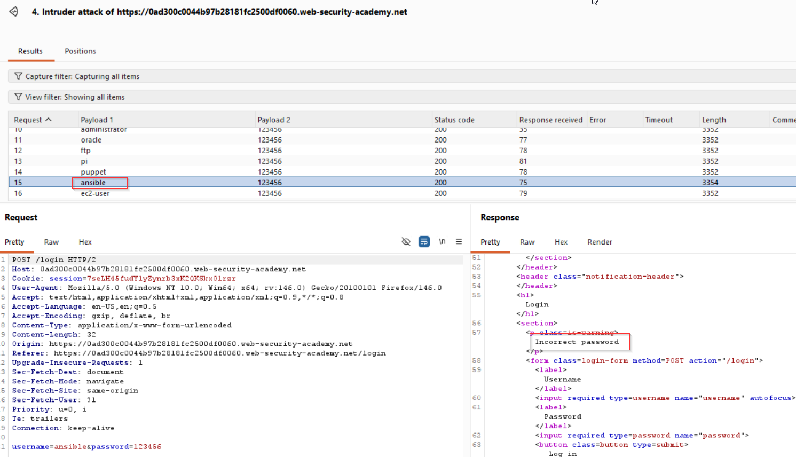
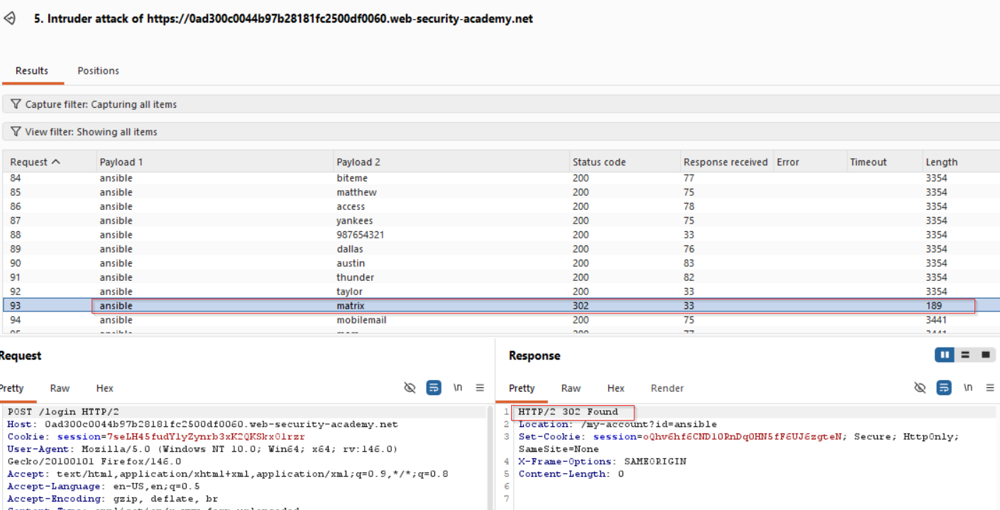

# Lab: Username Enumeration via Different Responses

## Objective

Identify a valid username by observing differences in the application's login responses, then determine the corresponding password and access the account.


## Vulnerability

The login mechanism reveals whether a username exists by returning a different response when the username is valid but the password is incorrect.

This creates a **username enumeration** vulnerability. Once a valid username is discovered, the attacker can focus password guessing attempts on that single account.

## Analysis

The login request was sent to **Burp Intruder** and tested using the supplied username and password wordlists. The key indicator was not simply whether the request returned `200`, but whether the response differed from the others. One response had a slightly different length, so I inspected it manually.

The response contained:

```text
Incorrect password
```

This was different from the responses produced for invalid usernames, which revealed that the submitted username existed.



In this lab, the valid username was identified as `ansible`.

Now, to reduce unnecessary requests, I kept the valid username fixed and run the password list against that account. Then, compared the resulting responses and identified the successful login from its different status/length and redirect behavior. The successful attempt returned a `302` response and redirected to the account page.



## Why It Works

The application leaks information through different responses:

```text
Invalid username  → account does not exist
Incorrect password → account exists
```

This turns the login endpoint into an oracle that answers whether a username is valid. After the valid username is known, only the password needs to be discovered, which substantially reduces the search space.

## Security Impact

Username enumeration can:

- Reveal valid customer or employee accounts.
- Make password brute-force attacks more efficient.
- Help attackers identify privileged accounts.
- Enable targeted credential-stuffing and phishing attacks.

## Remediation

The application should avoid giving attackers observable differences between invalid usernames and incorrect passwords.

### Use generic authentication errors

Instead of:

```text
Invalid username
Incorrect password
```

return the same message for both conditions:

```text
Invalid username or password
```

### Illustrative Remediation Example

```python
def login(username, submitted_password):
    user = find_user(username)

    if user and verify_password(user.password_hash, submitted_password):
        return login_success(user)

    return "Invalid username or password", 401
```

The public response is intentionally the same regardless of whether the username exists.

The application should also add rate limiting or progressive delays so that a large number of automated login attempts cannot be performed quickly.

```python
if too_many_failed_attempts(client_ip, username):
    return "Too many login attempts. Try again later.", 429
```

In production, the rate-limiting logic should be implemented using a robust server-side mechanism rather than only an in-memory counter.

## Key Takeaway

Authentication responses should not reveal whether a username exists. Small differences in response text, status codes, length, redirects, or timing can provide enough information for username enumeration and make subsequent password attacks much easier.
